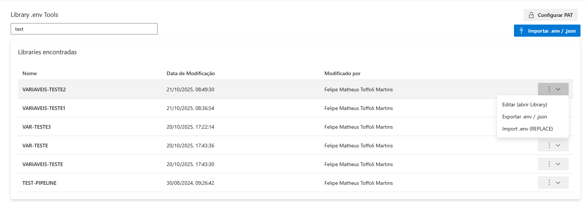
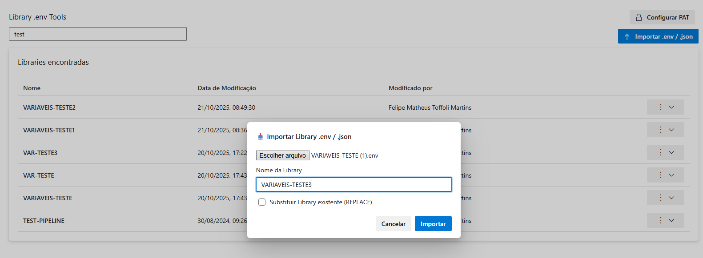
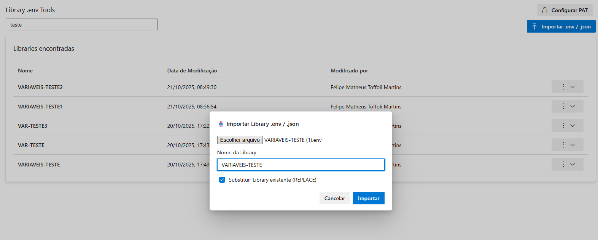
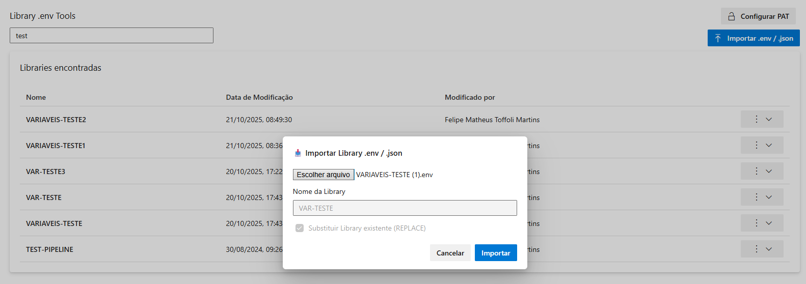
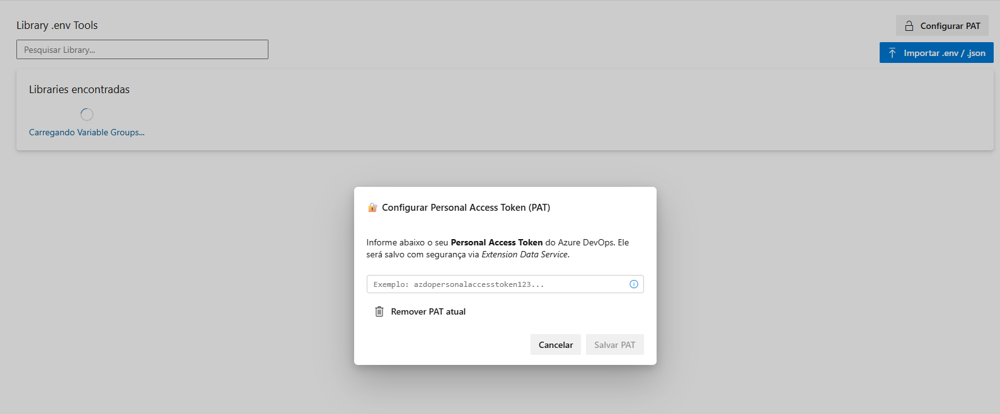

# 📦 Library .env Tools — Extensão Azure DevOps

Gerencie e integre seus arquivos `.env` e `.json` diretamente com as **Variable Groups (Libraries)** do Azure DevOps!
Com esta extensão, você pode **exportar, importar e sincronizar variáveis de ambiente** de forma simples e segura, sem precisar navegar manualmente pela interface do Azure.

---

## 🚀 Funcionalidades Principais

### ✅ **Listagem de Libraries**

- Visualize todas as Variable Groups disponíveis no projeto atual.
- Pesquise rapidamente pelo nome da library.

---

### 📤 **Exportar variáveis**

- Exporte qualquer Library para um arquivo `.env` ou `.json`.
- Escolha se deseja **incluir ou ocultar variáveis secretas**.
- Útil para replicar configurações entre projetos ou ambientes.

---

### 📥 **Importar variáveis**

- Importe um arquivo `.env` ou `.json` diretamente para o Azure DevOps.
- A extensão converte automaticamente o arquivo em um **Variable Group**.
- Caso o nome já exista, você pode:

- Criar um novo grupo com outro nome;
- **Ou substituir (REPLACE)** a library existente com as novas variáveis.

- Botão **Importar .env/.json**

(Checkbox de Replace por padrão desativado)

(Ao ativar checkbox, caso existir um grupo de variaveis com mesmo nome , os valores seram substituídos)
- Opção de **Importar .env (REPLACE)** diretamente do Grupo de Variaveis

---

### 🔁 **Importar com REPLACE direto**

- Na lista principal, clique em **“Import .env (REPLACE)”** para abrir o modal já configurado:

  - O nome da Library é preenchido automaticamente.
  - O checkbox “Substituir existente” vem ativado e bloqueado (não editável).
    

---

### 🔐 **Autenticação com PAT**

- A extensão solicita seu **Personal Access Token (PAT)** apenas uma vez.
- Ele é armazenado localmente e usado para autenticar as operações de leitura e escrita nas APIs do Azure DevOps.
- Você pode remover ou reconfigurar o PAT a qualquer momento no botão **“Configurar PAT”**.

---

## ⚙️ Requisitos

- Azure DevOps com permissões de acesso a **Libraries (Variable Groups)**.
- Token PAT com escopos mínimos:

  - `Read & Write` em **Variable Groups**
  - `Project and Team Read`

---

## 🧩 Como usar

1. Abra o menu lateral do Azure DevOps.
2. Acesse **Library .env Tools**.
3. Se for sua primeira vez, insira seu **PAT Token**.
4. Use os botões:

   - 🔍 Pesquisar Libraries
   - 📤 Exportar `.env / .json`
   - 📥 Importar novo arquivo
   - 🔁 Substituir Library existente

5. Verifique os logs do navegador caso ocorra algum erro (a extensão exibe alertas descritivos).

---

## 💡 Dicas de uso

- Utilize o formato `.env` para facilitar integração com aplicações.
- Use o formato `.json` para importar/exportar com automações.
- Sempre mantenha nomes de variáveis em **MAIÚSCULAS e sem espaços**.
- Ao importar, o nome da Library pode ser alterado antes de confirmar o envio.

---

## 🧠 Próximas melhorias (roadmap)

- [ ] Integração com Vault Hashicorp.
- [ ] Seguimentação de tipos de Libarys (prod, hom, dev ...).
- [ ] Favoritos.
- [ ] Configurar padronização de criação de Libary.
- [ ] Versão de Grupo de Variaveis com integração S3/MinIo.
- [ ] Integração com Vault Azure.

---

## 👨‍💻 Autor

**Felipe Matheus Toffoli Martins**
🔹 DevOps Engineer | Plataform Engenner
🔗 [LinkedIn](https://www.linkedin.com/in/felipetoffoli/)
💼 [GitHub](https://github.com/felipetoffoli)
